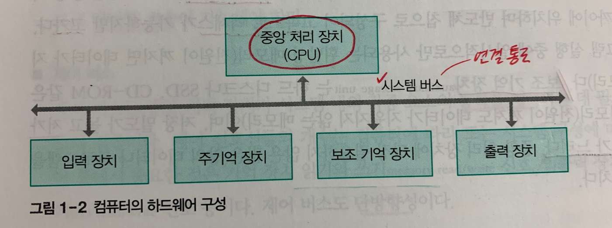
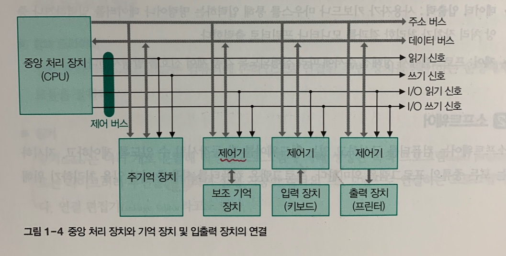
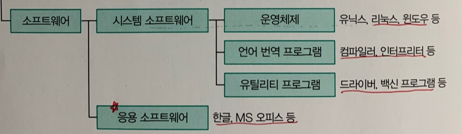
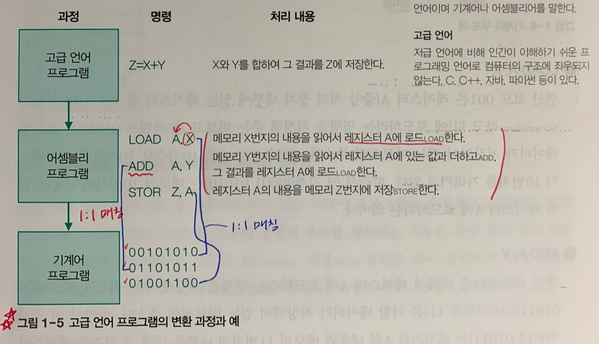
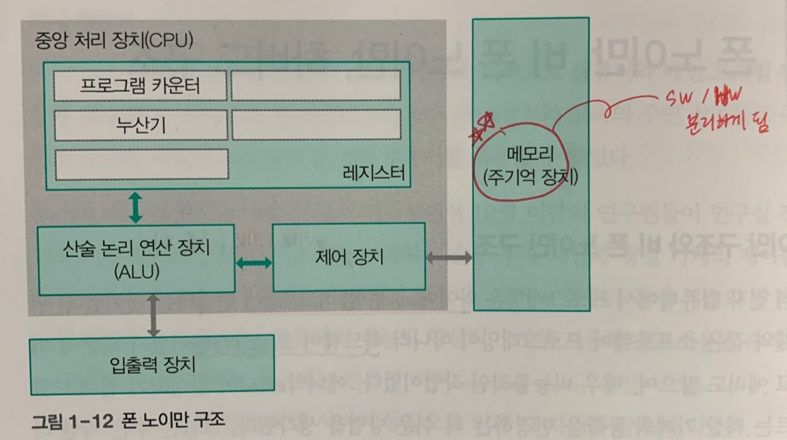
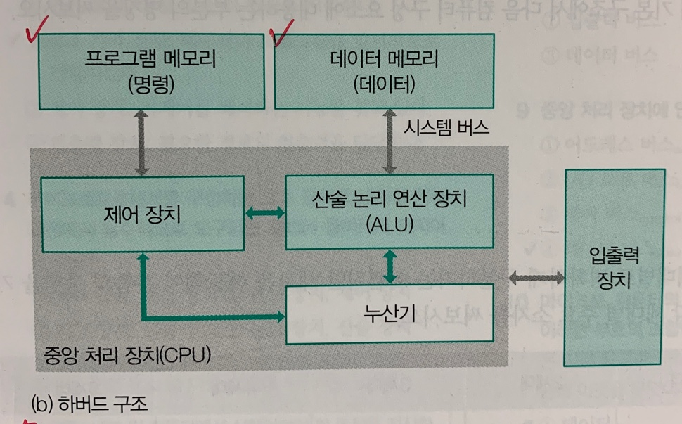

# 서론
컴퓨터 시스템은 기본적으로 하드웨어와 소프트웨어로 구성된다.
- 하드웨어(Hardware): 컴퓨터에서 각종 정보를 입력하여 처리하고 저장하는 동작이 실제 일어나게 해 주는 물리적인 실체
- 소프트웨어(Software): 정보 처리의 종류를 지정하고 정보의 이동 방향을 결정하는 동작이 일어나는 시간을 지정해 주는 명령(command)들의 집합(프로그램)

## 하드웨어
다음과 같이 구성되며 컴퓨터는 사용자가 작성한 프로그램들을 정해진 순서대로 실행하는데, 이러한 기능을 수행하기 위해 각 구성 요소들은 **시스템 버스** 를 통해 상호 연결되어 있다.

### 중앙 처리 장치(Central Processing Unit, CPU)
컴퓨터의 핵심 기능인 프로그램 실행과 데이터 처리를 담당한다. 프로세서(processor) 또는 마이크로프로세서(microprocessor)라고도 한다. 일반적으로 마이크로프로세서는 CPU를 IC 칩 1개에 집적한 반도체 소자를 의미한다.
- 산술 논리 연산 장치(Arithmetic and Logic Unit, ALU): 산술 연산(덧/뺄셈), 논리 연산(AND, OR, NOT), 보수 연산, 시프트(shift) 연산을 수행
- 제어 장치(Control Unit, CU): 프로그램의 명령어를 해독하여 명령어 실행에 필요한 제어 신호를 발생시키고 컴퓨터의 모든 장치를 제어
- 레지스터(register): CPU 내부에 있는 **데이터를 일시적으로 보관하는 임시 기억 장치**로, 프로그램 실행 중에 사용되며 고속으로 액세스(access) 할 수 있다.

### 기억 장치
CPU가 처리할 프로그램과 데이터는 기억 장치에 저장되는데, 기억 장치의 특성, 용도, 속도에 따라 다음과 같이 나뉜다.
- 주기억 장치(main memory): CPU에 가까이 위치하며, 반도체 칩으로 구성되어 **고속으로 액세스가 가능** 하지만 고가. 프로그램 실행 중에 일시적으로만 사용되는 **휘발성 메모리(전원이 꺼지면 데이터가 지워지는 메모리)** 임.
- 보조 기억 장치(auxilary storage unit): 하드 디스크나 SSD, CD-ROM 같은 비휘발성 메모리(전원이 꺼져도 데이터가 지워지지 않는 메모리)이며, 저장 밀도가 높고 저가이지만 속도가 느리다. CPU에 당장 필요하지 않은 많은 양의 데이터나 프로그램을 저장하는 장치.

📌 Main Memory: CPU와 보조 기억 장치간의 인터럽스시 발생할 수 있는 병목 현상 해소

### 입출력 장치
키보드, 마우스 같은 **입력 장치** 는 데이터를 전자적인 2진 형태로 변환하여 컴퓨터 내부로 전달. LCD 모니터나 프린터, 스피커 같은 **출력 장치** 는 CPU가 처리한 전자적인 형태의 데이터를 사람이 이해할 수 있는 데이터로 변환하여 출력.

### 시스템 버스(system bus)
CPU와 기억 장치 및 입출력 장치 사이에 정보를 교환하는 통로.
- 주소 버스(address bus): 기억 장치나 입출력 장치를 지정하는 **주소 정보를 전송** 하는 신호 선들의 집합. 주소는 CPU에서 발생되어 기억 장치와 입출력 장치로 보내지는 정보이기 때문에 주소 버스는 **단방향성** 이다.
- 데이터 버스(data bus): 기억 장치나 입출력 장치 사이에 데이터를 전송하기 위한 신호선들의 집합. 데이터선의 수는 CPU가 한 번에 전송할 수 있는 데이터 비트의 수를 결정함. 읽기와 쓰기 동작을 모두 지원해야 하므로 **양방향 전송** 이 가능해야 함.
- 제어 버스(control bus): CPU가 시스템 내의 각종 요소의 동작을 제어하는 데 필요한 신호선들의 집합. **단방향성** 이다.

## 소프트웨어
컴퓨터를 구성하고 있는 하드웨어를 잘 동작시킬 수 있도록 제어하고, 지시하는 모든 종류의 프로그램을 의미.

## 프로그램 처리 과정

어셈블리 명령어의 동작을 개략적으로 이해할 수 있도록 사용된 기호인 LOAD, ADD, STOR를 니모닉이라 한다. 위 그림에선 번역된 기계어는 3bit 연산 코드(opcode)와 5bit 오퍼랜드(operand)로 구성되어 있다. 연산코드는 수행할 연산을 지정하고, 오퍼랜드는 명령어가 사용할 데이터가 저장되어 있는 기억 장소의 주소를 가리킨다.

## 폰 노이만 구조와 비 폰 노이만 구조
가장 초기의 전자 컴퓨터에서 프로그래밍은 와이어(wire)를 플러그(plug)에 연결하는 것(HW와 SW의 구분 X)이었고 소프트웨어 프로그래밍이 아닌 하드웨어 프로그래밍이었다. 이는 에러도 많고 매우 비능률적인 작업이었다.

폰 노이만 구조는 주기억 장치에 프로그램과 데이터를 넣고 차례로 인출하여 처리하는 방식이다. CPU와 주기억장치(메모리), 입출력 장치로 구성되고 다음과 같은 과정으로 프로그램을 처리한다.
1. 프로그램 카운터를 이용해 메모리에서 실행할 명령어를 인출(fetch)
2. 제어 장치는 이 명령어를 해독(decode)
3. 명령을 실행하는 데 필요한 데이터를 메모리에서 인출하여 레지스터에 저장
4. ALU는 명령을 실행하고, 레지스터나 메모리에 결과를 저장

하지만 **폰 노이만 병목 현상** 이라는 단점이 있다.

폰 노이만 구조의 컴퓨터는 CPU에서 명령어나 데이터를 메모리에서 가져와 처리한 후, 결과 데이터를 메모리에 다시 보내 저장한다. 또한 저장된 데이터가 필요할 땐 다시 메모리에서 CPU로 불려오는 방식으로 순차적으로 프로그램을 처리하므로 메모리나 시스템 버스에 병목 현상이 생겨 느려질 수 밖에 없다. 이를 데이터 경로의 병목현상 또는 기억 장소의 지연 현상이라고도 한다. 또한 CPU의 연산 속도가 아무리 빨라져도 한 가지씩 일을 순차적으로 처리하므로 지능 축적이 불가능하다.

// 비 폰노이만 구조: 폰 노이만 구조가 아닌 컴퓨터를 통틀어 이르는 말.

## 하버드 구조
폰 노이만 구조의 단점을 보완하여 **명령어 메모리 영역과 데이터 메모리 영역을 물리적으로 분리** 시키고, 각각을 다른 시스템 버스로 CPU에 연결함으로써 명령과 데이터를 메모리로부터 읽는 것을 **동시에 처리** 할 수 있다.

하버드 구조는 CPU와 캐시의 관계에 활용되고 있다. 캐시에 오류가 일어나면 주기억 장치로부터 데이터를 가져 오고, 명령 캐시나 데이터 캐시에 저장한다.