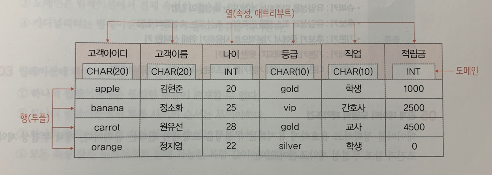
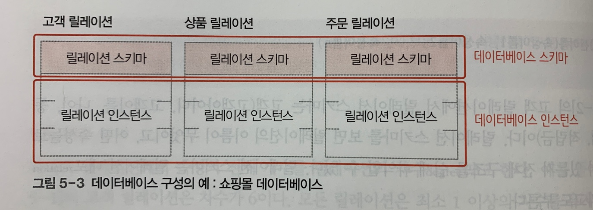
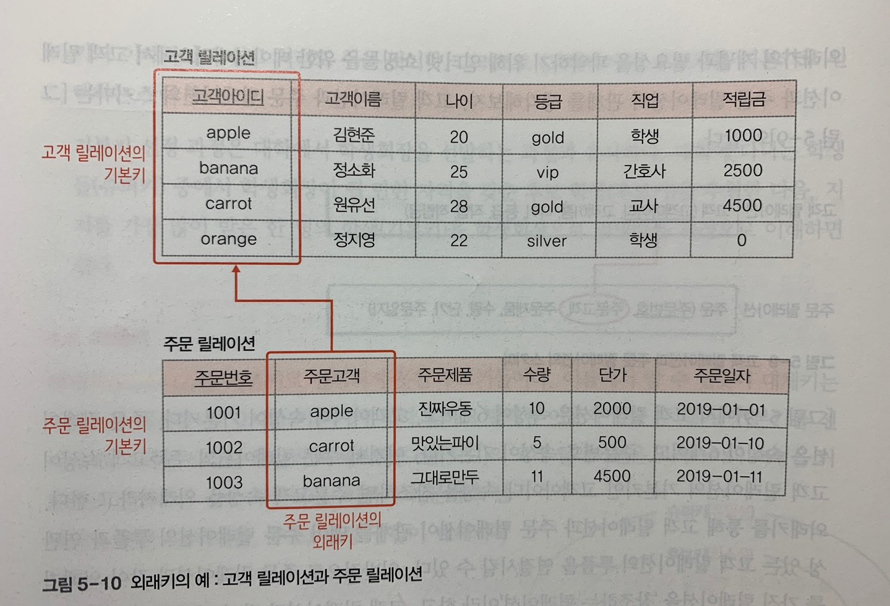
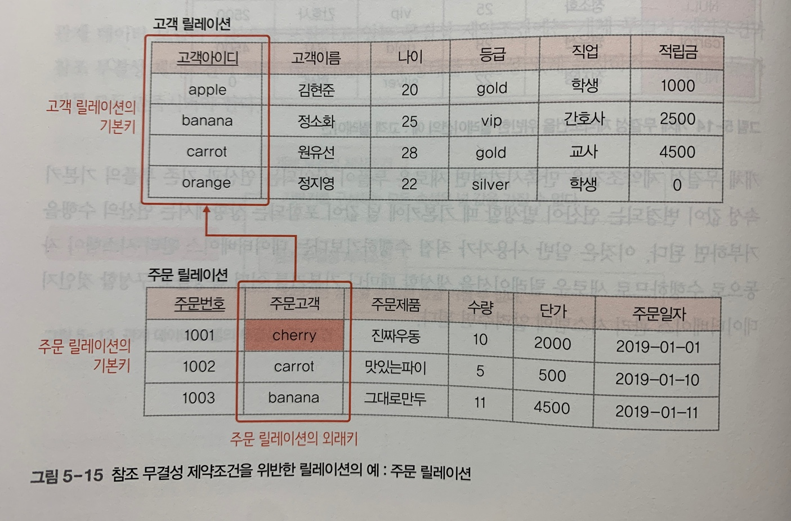

# 관계 데이터 모델
## 1. 관계 데이터 모델의 개념과 기본 용어
개념적 구조를 논리적 구조로 표현하는 논리적 데이터 모델 중 하나. 관계 데이터 모델은 하나의 개체에 대한 데이터를 릴레이션 하나에 담아 데이터베이스에 저장한다.
> - 릴레이션: 하나의 개체에 관한 데이터를 2차원 테이블의 구조로 저장한 것.
> - 속성(애트리뷰트)과 튜플: 릴레이션의 열과 행.
> - 도메인: 하나의 속성이 가질 수 있는 값들의 집합.
> - 널(Null): 아직 모르거나 해당되는 사항이 없음을 표현하는 특별한 값.
> - 차수: 하나의 릴레이션에서 속성의 전체 개수.
> - 카디널리티: 하나의 릴레이션에서 튜플의 전체 개수.
> 

## 2. 릴레이션과 데이터베이스의 구성
릴레이션은 릴레이션 스키마와 릴레이션 인스턴스로 구성된다. 일반적으로 데이터베이스는 릴레이션 여러 개로 구성된다.
> - 릴레이션 스키마: 릴레이션의 이름과 릴레이션에 포함된 모든 속성의 이름으로 정의하는 릴레이션의 논리적 구조
> - 릴레이션 인스턴스: 어느 한 시점에 릴레이션에 존재하는 튜플들의 집합
> - 데이터베이스 스키마: 데이터베이스를 구성하는 릴레이션 스키마의 모음
> - 데이터베이스 인스턴스: 데이터베이스를 구성하는 릴레이션 인스턴스의 모음
> 

## 3. 릴레이션의 특성
> - 튜플의 유일성: 하나의 릴레이션에는 동일한 튜플이 존재할 수 없다.
> - 튜플의 무순서: 하나의 릴레이션에서 튜플 사이의 순서는 무의미하다.
> - 속성의 무순서: 하나의 릴레이션에서 속성 사이의 순서는 무의미하다.
> - 속성의 원자성: 속성 값으로 원자 값만 사용할 수 있다.

## 4. 키
키는 릴레이션에서 튜플들을 구별하는 역할을 하는 속성 또는 속성들의 집합이다.
| 특성 |
|---|
| - 유일성 : 한 릴레이션에서 모든 튜플은 서로 다른 키 값을 가져야 함. |
| - 최소성 : 꼭 필요한 최소한의 속성들로만 키를 구성함. |

| 종류 |
|---|
| - 슈퍼키 : 유일성을 만족하는 속성 또는 속성들의 집합 |
| - 후보키 : 유일성과 최소성을 만족하는 속성 또는 속성들의 집합 |
| - 기본키 : 후보키 중에서 기본적으로 사용하기 위해 선택한 키 |
| - 대체키 : 기본키로 선택되지 못한 후보키 |
| - 외래키 : 다른 릴레이션의 기본키를 참조하는 속성 또는 속성들의 집합 |

**_📌기본키를 선택할 때 고려하면 도움이 되는 기준?_**
> - 널 값을 가질 수 있는 속성이 포함된 후보키는 기본키로 부적합하다.
> - 값이 자주 변경될 수 있는 속성이 포함된 후보키는 기본키로 부적합하다.
> - 단순한 후보키를 기본키로 선택한다.

## 5. 관계 데이터 모델의 제약조건
데이터를 정확하고 유효하게 유지하는 무결성을 보장해야 된다는 규칙이다.
> - 개체 무결성 제약조건: 기본키를 구성하는 모든 속성은 널 값을 가질 수 없다.
> - 참조 무결성 제약조건: 외래키는 참조할 수 없는 값을 가질 수 없다.

// 외래키가 널 값을 가진다고 해서 항상 참조 무결성 제약조건을 위반한 것은 아님.