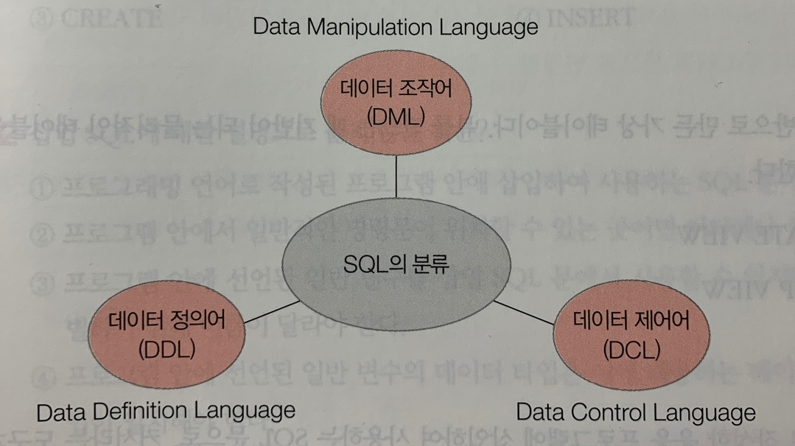

# 데이터베이스 언어 SQL
## 1. SQL
관계 데이터베이스를 위한 표준 질의어다.
> 
> - 데이터 정의어(DDL): 테이블을 생성하고 변경/제거하는 기능을 제공
> - 데이터 조작어(DML): 테이블에 새 데이터를 삽입하거나, 테이블에 저장된 데이터를 수정/삭제/검색하는 기능을 제공
> - 데이터 제어어(DCL): 보안을 위해 데이터에 대한 접근 및 사용 권한을 사용자별로 부여하거나 취소하는 기능을 제공하는 언어.

## 2. SQL의 데이터 정의 기능
### 1) 테이블 생성: CREATE TABLE
```sql
CREATE TABLE 테이블_이름(
    1. 속성_이름 데이터_타입 [NOT NULL] [DEFAULT 기본_값]
    2. [PRIMARY KEY (속성_리스트)]
    3. [UNIQUE (속성_리스트)]
    4. [FOREIGN KEY (속성_리스트) REFERENCES 테이블_이름(속성_리스트)] [ON DELETE 옵션] [ON UPDATE 옵션]
    5. [CONSTRAINT 이름] [CHECK 조건]
);
```
> 1. 테이블을 구성하는 각 속성의 이름과 데이터 타입, 기본적인 제약사항 정의
> 2. 기본키로 테이블에 하나만 존재할 수 있다.
> 3. 대체키로 테이블에 여러 개 존재할 수 있다.
> 4. 외래키로 테이블에 여러 개 존재할 수 있다.
> 5. 데이터 무결성을 위한 제약조건으로 테이블에 여러 개 존재할 수 있다.   
> ([ ] 로 표시한 항목은 생략 가능함.)

📌 속성의 데이터 타입
| 데이터 타입 | 의미 |
|---|:---|
| INT 또는 INTEGER | 정수
| SMALLINT | INT보다 작은 정수
| CHAR(n) 또는 CHARACTER(n) | 길이가 n인 가변 길이의 문자열
| VARCHAR(n) 또는 CHARACTER VARYING(n) | 최대 길이가 n인 가변 길이의 문자열
| NUMERIC(p, s) 또는 DECIMAL(p, s) | 고정 소수점 실수. p는 소수점을 제외한 전체 숫자의 길이. s는 소수점 이하 숫자의 길이
| FLOAT(n) | 길이가 n인 부동 소수점 실수
| REAL | 부동 소수점 실수
| DATE | 연, 월, 일로 표현되는 날짜
| TIME | 시, 분, 초로 표현되는 시간
| DATETIME | 날짜와 시간

Ex) 테이블 생성 예시
```sql
CREATE TABLE 주문 (
    주문번호 CHAR(3) NOT NULL,
    주문고객 VARCHAR(20),
    주문제품 CHAR(3),
    수량 INT,
    배송지 VARCHAR(30),
    주문일자 DATE,
    PRIMARY KEY(주문번호),
    FOREIGN KEY(주문고객) REFERENCES 고객(고객아이디),
    FOREIGN KEY(주문제품) REFERENCES 제품(제품번호)
);
```

### 2) 테이블 변경: ALTER TABLE
```sql
// 새로운 속성 추가
ALTER TABLE 테이블_이름 ADD 속성_이름 데이터_타입 [NOT NULL] [DEFAULT 기본_값];

// 기존 속성 삭제
ALTER TABLE 테이블_이름 DROP COLUMN 속성_이름;

// 새로운 제약조건 추가
ALTER TABLE 테이블_이름 ADD CONSTRAINT 제약조건_이름 제약조건_내용;

// 기존 제약조건의 삭제
ALTER TABLE 테이블_이름 DROP CONSTRAINT 제약조건_이름;
```
> 만약 삭제할 속성과 관련된 제약조건이 존재하거나 이 속성을 참조하는 다른 속성이 존재하는 경우, 속성을 삭제할 수 없다. 관련된 제약조건이나 참조하는 다른 속성을 먼저 삭제한 후 해당 속성을 삭제해야 한다.

### 3) 테이블 삭제: DROP TABLE
```sql
DROP TABLE 테이블_이름;
```
> 삭제할 테이블을 참조하는 테이블이 있다면 삭제가 수행되지 않는다. 따라서 삭제하고자 하는 테이블을 참조하는 외래키 제약조건을 먼저 삭제해야 한다.

## 3. SQL의 데이터 조작 기능
### 1) 검색
| 검색 |
|---|
| - 기본 검색: SELECT FROM |
| - 조건 검색: SELECT FROM WHERE |
| - 정렬 검색: SELECT FROM  WHERE ORDER BY |
| - 집계 함수를 이용한 검색: COUNT, SUM, AVG, MAX, MIN |
| - 그룹 검색: SELECT FROM WHERE GROUP BY HAVING (ORDER BY) |
| - 조인 검색: 여러 테이블을 연결하여 검색 |
| - 부속 질의문 검색: SELECT 문 안에 또 다른 SELECT 문을 포함 |
> 조인 검색의 경우, 테이블을 연결해주는 속성인 조인 속성이 필요하고 이 속성의 이름은 달라도 되지만, 도메인은 반드시 같아야 한다. 일반적으로 외래키를 조인 속성으로 이용한다.

Ex) 조인 검색의 예시
```sql
SELECT 제품.제품명
FROM 제품, 주문
WHERE 주문.주문고객 = 'banana' AND 제품.제품번호 = 주문.주문제품;
```

> 부속 질의문을 이용한 검색은 부속 질의문을 먼저 수행하고, 그 결과를 이용해 상위 질의문을 수행하여 최종 결과 테이블을 반환한다. 부속 즈리의문은 괄호로 묶어 작성하고 ORDER BY 절을 사용할 수 없다.

Ex) 부속 질의문 예시
```sql
SELECT 제품명, 단가
FROM 제품
WHERE 제조업체 = (SELECT 제조업체
                 FROM 제품
                 WHERE 제품명 = 'Macbook Pro');
```

### 2) 삽입
| 데이터 삽입 |
|---|
| INSERT |

```sql
// 데이터 직접 삽입
INSERT
INTO 테이블_이름[(속성_리스트)]
VALUES (속성값_리스트);

// 부속 질의문을 이용한 데이터 삽입
INSERT
INTO 테이블_이름[(속성_리스트)]
SELECT 문;
```

### 3) 수정
| 데이터 수정 |
|---|
| UPDATE |

```sql
UPDATE 테이블_이름
SET 속성_이름1 = 값1, 속성_이름2 = 값2, ...
[WHERE 조건];
```

### 4) 삭제
| 데이터 삭제 |
|---|
| DELETE |

```sql
DELETE
FROM 테이블_이름
[WHERE 조건];
```

## 4. SQL의 데이터 제어 기능
보안을 위해 사용자별로 데이터에 대한 접근 및 사용 권한을 부여하거나 취소하는 기능으로, 데이터베이스 관리자가 주로 사용한다.

## 5. 뷰
다른 테이블을 기반으로 만든 가상 테이블. 뷰를 만드는 데 기반이 되는 물리적인 테이블을 기본 테이블이라 함.

### 1) 뷰 생성: CREATE VIEW
```sql
CREATE VIEW 뷰_이름[(속성_리스트)]
AS SELECT 문
[WITH CHECK OPTION];
```

Ex) 예시
```sql
CREATE VIEW 우수고객(고객아이디, 고객이름, 나이)
AS SELECT 고객아이디, 고객이름, 나이
   FROM 고객
   WHERE 등급 = 'vip'
WITH CHECK OPTION;

SELECT * FROM 우수고객;
```
> - 뷰가 가상 테이블임에도 SELECT 문을 이용해 검색할 수 있는 이유??   
> 뷰에 대한 SELECT 문이 내부적으로는 기본 테이블에 대한 SELECT 문으로 변환되어 수행되기 때문.
> - 삽입/수정/삭제 연산이 모든 뷰에 허용되는 것은 아니다. 뷰에 대한 다음 연산들은 결과적으로 기본 테이블의 내용을 자동으로 바꾸기 때문에 주의해서 사용해야 한다.

| 📌 변경 불가능한 뷰의 중요한 특징 |
|---|
| - 기본 테이블의 기본키를 구성하는 속성이 포함되어 있지 않은 뷰는 변경할 수 없다. |
| - 기본 테이블에 있던 내용이 아니라 집계 함수로 새로 계산된 내용을 포함하고 있는 뷰는 변경할 수 없다. |
| - DISTINCT 키워드를 포함하여 정의한 뷰는 변경할 수 없다. |
| - GROUP BY 절을 포함하여 정의한 뷰는 변경할 수 없다. |
| - 여러 개의 테이블을 조인하여 정의한 뷰는 변경할 수 없는 경우가 많다. |

📌 뷰의 장점
> - 질의문을 좀 더 쉽게 작성할 수 있다.
> - 데이터의 보안 유지에 도움이 된다.
> - 데이터를 좀 더 편리하게 관리할 수 있다.

### 2) 뷰 삭제: DROP VIEW
```sql
DROP VIEW 뷰_이름;
```
> 뷰를 삭제하더라도 기본 테이블은 영향을 받지 않는다.  
> 만약 삭제할 뷰를 참조하는 제약조건이 존재한다면 삭제가 수행되지 않는다.