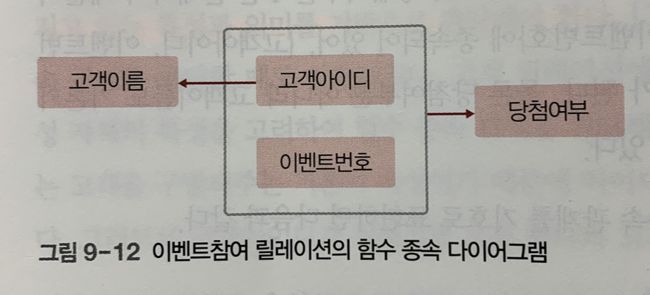
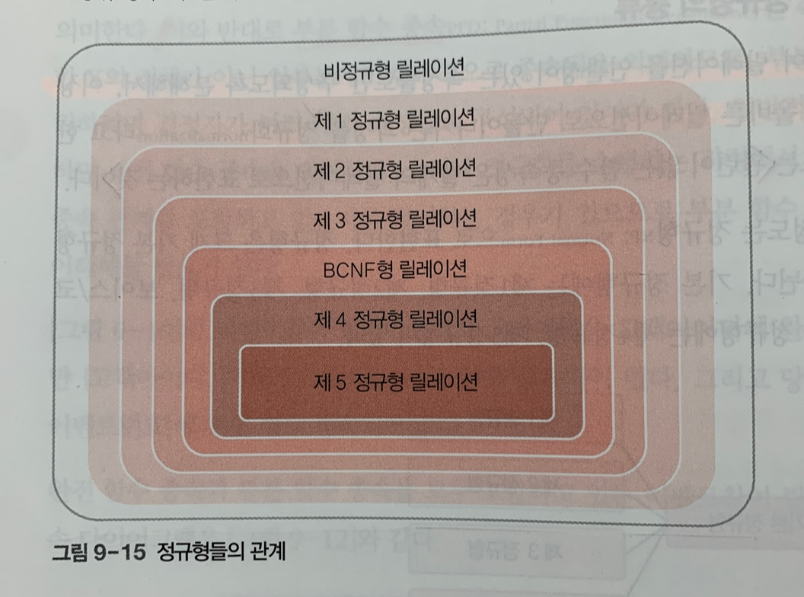
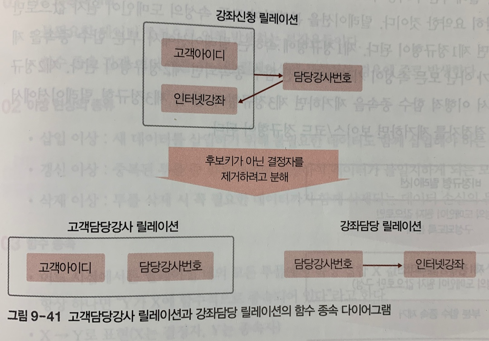

# 정규화
## 1. 이상 현상과 정규화
- 이상 현상: 불필요한 데이터 중복으로 인해 발생하는 부작용들. 함수 종속 관계 여러 개를 하나의 릴레이션에 표현하는 경우에 주로 발생함.
- 정규화: 이상 현상을 제거하면서 데이터베이스를 올바르게 설계해나가는 과정.     

일반적으로 릴레이션에 함수적 종속성이 하나 존재하도록 정규화를 통해 릴레이션을 분해한다.

## 2. 이상 현상의 종류
- 삽입 이상: 새 데이터를 삽입하기 위해 불필요한 데이터도 함께 삽입해야 하는 문제
- 갱신 이상: 중복된 튜플 중 일부 튜플만 변경하여 데이터가 불일치하게 되는 모순의 문제
- 삭제 이상: 튜플 삭제 시 꼭 필요한 데이터까지 함께 삭제되는 데이터 손실의 문제

## 3. 함수 종속
- 어느 시점에서든 릴레이션 내의 모든 튜플에서 속성 집합 X 값 각각에 대한 속성 집합 Y 값이 항상 하나면 "Y가 X에 함수적으로 종속되어 있다"라고 한다.
- X -> Y로 표현(X는 결정자, Y는 종속자)
- 완전 함수 종속(FFD: Full Functional Dependency): 릴레이션에서 속성 집합 Y가 속성 집합 X에 함수적으로 종속되어 있지만, 속성 집합 X 전체에 종속된 것이지 일부분에 종속된 것이 아님을 의미
- 부분 함수 종속(PFD: Partial Functional Dependency): 속성 집합 Y가 속성 집합 X의 전체가 아닌 일부분에도 함수적으로 종속됨을 의미. 이 관계가 성립하려면 결정자가 여러 개의 속성들로 구성되어 있어야 함.

## 4. 함수 종속 다이어그램
릴레이션 하나를 구성하는 속성들 간의 함수 종속 관계를 도식화하여 표현한 것이다.

## 5. 정규화
함수 종속성을 이용하여, 릴레이션을 연관성이 있는 속성들로만 구성되도록 분해해 이상 현상이 발생하지 않는 바람직한 릴레이션으로 만들어나가는 과정이다.

정규화의 기본목표는 __관련이 없는 함수 종속성은 별개의 릴레이션으로 표현하는 것__ 이다. 

## 6. 정규형
릴레이션이 정규화된 정도를 나타내는 기준이다. 각 정규형마다 만족시켜야 하는 제약조건이 존재한다. 릴레이션이 특정 정규형의 제약조건을 만족하면 릴레이션이 해당 정규형에 속한다고 표현한다. __정규형의 차수가 높아질수록 요구되는 제약조건이 많아지고 엄격해진다. 일반적으로 차수가 높은 정규형에 속하는 릴레이션일수록 데이터 중복이 줄어 데이터 중복에 의한 이상 현상이 발생하지 않는 바람직한 릴레이션일 수 있다.__ 하지만, 모든 릴레이션이 제5정규형에 속해야 되는 것은 아니므로 릴레이션의 특성을 고려해 적합한 정규형을 선택해야 한다.

### 제1정규형: 릴레이션에 속한 모든 속성의 도메인이 원자 값으로만 구성되어 있다.
다중 값을 가지는 속성을 포함한 릴레이션은 제1정규형의 제약조건을 만족하지 못하므로 제1정규형에 속하지 않는다.

### 제2정규형: 릴레이션이 제1정규형에 속하고, 기본키가 아닌 모든 속성이 기본키에 완전 함수 종속되어 있다.
부분 함수 종속을 제거하고 모든 속성이 기본키에 완전 함수 종속되도록 릴레이션을 분해하는 정규화 과정을 거쳐야 한다. 정규화 과정에서 릴레이션을 분해할 때 주의할 점은, 분해된 릴레이션을 자연 조인하여 분해 전의 릴레이션으로 다시 복원할 수 있어야 한다는 것이다.

### 제3정규형: 릴레이션이 제2정규형에 속하고, 기본키가 아닌 모든 속성이 기본키에 이행적으로 함수 종속되지 않았다.
> 📌 이행적 함수 종속(transitive FD): 릴레이션을 구성하는 3개의 속성 집합 X, Y, Z에 대해 함수 종속 관계 X->Y, Y->Z가 존재하면 논리적으로 X->Z가 성립한다.     
> 이행적 함수 종속이 나타나는 이유는 함수 종속 관계가 하나의 릴레이션에 여러 개 존재하기 때문이다.

일반적으로 3개의 X, Y, Z 속성 집합으로 구성된 릴레이션에 X->Y, Y->Z라는 함수 종속관계와 이로 인한 X->Z라는 이행적 함수 종속 관계가 존재한다면, 이 같은 함수 종속 관계의 의미가 유지되도록 분해해야 한다.

### 보이스/코드 정규형: 릴레이션의 함수 종속 관계에서 모든 결정자가 후보키다.
실제로는 하나의 릴레이션에 여러 개의 후보키가 존재할 수도 있는데, 이 경우 제3정규형까지 모두 만족하더라도 이상 현상이 발생할 수 있다. 후보키를 여러 개 가지고 있는 릴레이션에 발생할 수 있는 이상 현상을 해결하기 위해 제3정규형보다 좀 더 엄격한 제약조건을 제시한 것이 보이스/코드 정규형이다. 보이스/코드 정규형을 강한 제3정규형이라고도 한다.

### 제4정규형과 제5정규형
고급 정규형으로 분류되는 제4정규형은 릴레이션이 보이스/코드 정규형을 만족하면서, 함수 종속이 아닌 다치 종속(MVD: Multi Valued Dependency)을 제거해야 만족할 수 있다. 그리고 제5정규형은 릴레이션이 제4정규형을 만족하면서 후보키를 통하지 않는 조인 종속(JD: Join Dependency)을 제거해야 만족할 수 있다.

실제로 데이터베이스를 설계할 때 모든 릴레이션이 무조건 제5정규형에 속하도록 분해해야 하는 것은 아니다. 오히려 제5정규형을 만족할 때까지 분해하면 비효율적이고 바람직하지 않은 경우가 많다. 일반적으로는 제3정규형이나 보이스/코드 정규형에 속하도록 릴레이션을 분해하여 데이터 중복을 줄이고 이상 현상이 발생하는 문제를 해결하기 때문에 기본 정규형을 중심으로 설계하곤 한다.