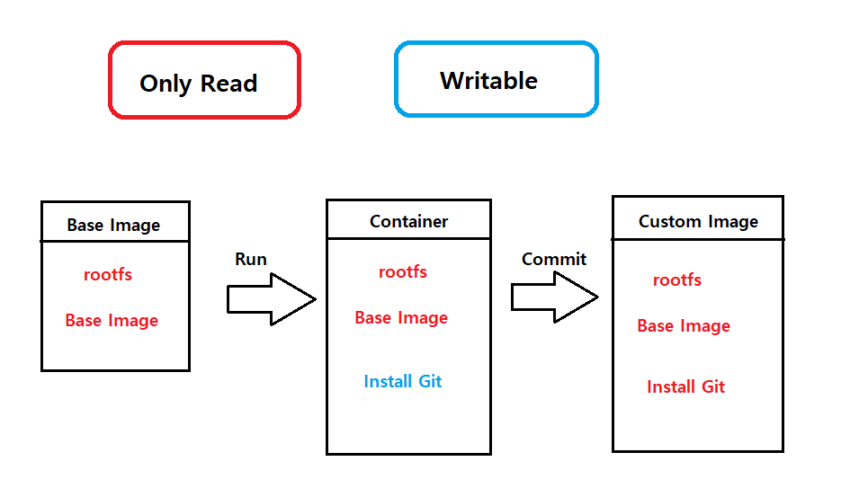

# Docker Image
## 이미지란?
도커는 레이어드 파일 시스템 기반. 이미지는 프로세스가 실행되는 파일들의 집합(환경)이고 프로세스는 환경(파일)을 변경할 수 있음. 이 환경을 저장해서 새로운 이미지를 만든다.

- Only Read vs Writable


다음과 같이 상태 변화를 겪는다. Base Image에서 Git을 설치한 새로운 상태가 된 컨테이너를 이미지로 저장하는 것이다.

```bash
$ docker bulid -t (이름공간)/(이미지이름):(태그) .(빌드 컨텍스트)
```

- 예시    


다음과 같이 ubuntu 환경에서 Git이 정상적으로 설치된 것을 확인할 수 있다.

// 참고로 한번에 성공하는 빌드는 없다. 파란불(빌드 성공)이 뜰 때까지 많은 빨간불(빌드 실패)를 경험하게 되는데 일단 파란불이 켜져도 리팩토링을 통해 더 최적화된 이미지를 생성하도록 하자.

## Dockerfile
서버에 들어가서 하는 기존의 작업들을 Dockerfile로 관리하면 상당한 이점이 있다. __컨테이너 이미지를 코드로 저장__ 할 수 있고 __유지 관리 및 업그레이드를 위해 이미지를 신속하고 정확하게 다시 만들 수 있다.__ 또한 설치 히스토리를 기록으로 확인할 수 있고 이를 통해 __컨테이너 이미지와 개발 주기 간의 연속 통합을 제공한다.__

|||
|---|---|
| FROM | 기본 이미지 |
| RUN | 쉘 명령어 실행 |
| CMD | 컨테이너 기본 실행 명령어(Entrypoint의 인자로 사용) |
| EXPOSE | 오픈되는 포트 정보 |
| ENV | 환경변수 설정 |
| ADD | 파일 또는 디렉토리 추가. URL/ZIP 사용가능 |
| COPY | 파일 또는 디렉토리 추가 |
| ENTRYPOINT | 컨테이너 기본 실행 명령어 |
| VOLUME | 외부 마운트 포인트 생성 |
| USER | RUN, CMD, ENTRYPOINT를 실행하는 사용자 |
| WORKDIR | 작업 디렉토리 설정 |
| ARGS | 빌드타임 환경변수 설정 |
| LABEL | key - value 데이터 |
| ONBUILD | 다른 빌드의 베이스로 사용될때 사용하는 명령어 |

## 이미지 빌드하기
```bash
docker bulid -t {이미지명:이미지태그} {빌드 컨텍스트}

$ docker build -t sample:1 .
```
현재 디렉토리의 Dockerfile로 빌드
- -f<Dockerfile 위치> 옵션을 사용해 다른 위치의 Dockerfile 파일 사용 가능
- -t 명령어로 도커 이미지 이름을 지정
- {네임스페이스}/{이미지이름}:{태그} 형식

마지막에는 빌드 컨텍스트 위치를 지정
- 현재 디렉터리를 의미하는 점(.)을 주로 사용
- 필요한 경우 다른 디렉터리를 지정할 수도 있음

## .dockerignore
.gitignore와 비슷한 역할로 도커 빌드 컨텍스트에서 지정된 패턴의 파일을 무시한다. .git이나 민감한 정보를 제외하는 용도로 주로 사용되며 .git이나 에셋 디렉터리만 제외시켜도 빌드 속도가 개선된다. 이미지 빌드 시에 사용하는 파일은 제외시키면 안된다.