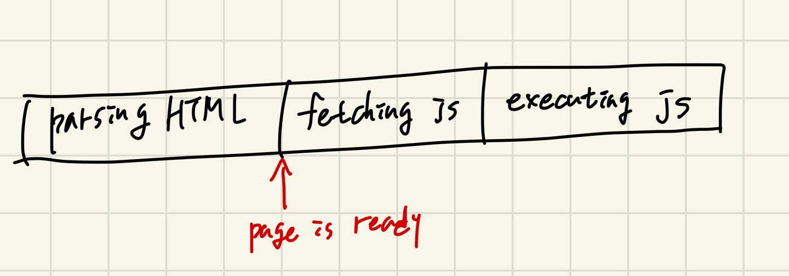

# script asyn와 defer의 차이점
# 1. head 태그 안에 있는 script 태그
```html
<!DOCTYPE html>
<html lang="en">
<head>
  <meta charset="UTF-8">
  <meta name="viewport" content="width=device-width, initial-scale=1.0">
  <title>index</title>
  <script src="main.js"></script>
</head>
<body></body>
</html>
```
> 
> 다음과 같은 html문서를 브라우저는 제일 위부터 순서대로 하나씩 해석해 나간다. head 안에 script를 포함하게 되면 브라우저가 문서를 읽다가 script 태그를 다운받아야 한다고 이해하게 된다. 이럴 때 다운받아야 하는 js파일의 크기가 매우 크다면 사용자가 웹사이트를 보는데 많은 시간이 소요가 된다. 따라서 좋은 방법이 아니다.

# 2. body 태그 아래에 있는 script 태그
```html
<!DOCTYPE html>
<html lang="en">
<head>
  <meta charset="UTF-8">
  <meta name="viewport" content="width=device-width, initial-scale=1.0">
  <title>index</title>
</head>
<body>
  <script src="main.js"></script>
</body>
</html>
```
> 
> html 자체는 빨리 로딩되지만, js파일에 의존하는 형식이라면 사용자가 의미있는 컨텐츠를 보는데 시간이 오래걸린다. (해당 파일을 서버에서 받아오는 시간만큼)

# 3. asyn 속성값 사용
```html
<!DOCTYPE html>
<html lang="en">
<head>
  <meta charset="UTF-8">
  <meta name="viewport" content="width=device-width, initial-scale=1.0">
  <title>index</title>
  <script asyn src="main.js"></script>
</head>
<body></body>
</html>
```
> 
> parsing하는 동안 fetching의 병렬적 동작으로 다운로드 시간이 절약된다. 다만 parsing이 되기 전 실행되기 때문에 js에서 쿼리셀렉터를 이용해 dom요소를 조작한다면 조작 시점에 요소가 정의되어있지 않아 위험할 수 있고, html을 parsing하는 동안 언제든지 js를 실행하기 위해 멈출 수 있기 때문에 사용자가 page를 보는데 시간이 조금 더 걸릴 수 있는 단점이 있다.

# 4. defer 속성값 사용
```html
<!DOCTYPE html>
<html lang="en">
<head>
  <meta charset="UTF-8">
  <meta name="viewport" content="width=device-width, initial-scale=1.0">
  <title>index</title>
  <script defer src="main.js"></script>
</head>
<body></body>
</html>
```
> 
> defer를 사용하게 되면, 브라우저가 parsing하다 script defer를 보는 순간 해당 파일을 다운로드 받자 명령만 실행시켜놓고 나머지 html을 끝까지 parsing하게 된다. parsing이 끝난 뒤 다운로드 된 js를 실행하게 된다. 다시 말해, html을 parsing하는 동안 필요한 js를 모두 다운받아놓고 사용자에게 page를 보여주고 나서 js를 실행하기 때문에 가장 좋은 옵션이다. 여러 js파일이 뒤섞여 다운받는 상황이라도 parsing 이후 필요한 파일들을 순서에 맞게 순차적으로 실행시키는 장점 또한 존재한다.