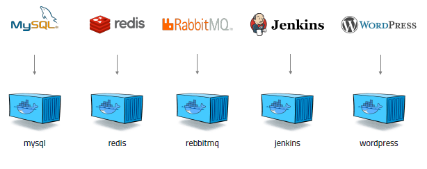

# Docker?
> 도커는 컨테이너 기반의 오픈소스 가상화 플랫폼이다.   
> 서버 관리는 상당히 복잡하다. Oracle을 설치해달라는 요구사항, Gitlab을 설치해달라는 요구사항, MongoDB를 설치해달라는 요구사항이 있을 때 Linux 환경, Windows 환경 등 다양한 환경마다 요구사항을 충족하는 방법이 제각각 다르고 이슈가 발생했을 때 일일이 해결하기가 까다롭다.    
> AWS를 사용하던 서버 환경이 어느날 Azure 환경으로, Google Cloud 환경으로 계속해서 바뀔 수 있고 개발환경 또한 Node.js를 사용하다 Spring 기반 마이크로서비스로 바뀔 수도 있고 사용 언어도 제각각 달라질 수도 있다.   
> Docker가 등장하고 서버관리 및 개발 방식이 상당히 편리하게 바뀌게 되었다.
>   
> 
> 
> 어떠한 프로그램도 다음과 같이 컨테이너로 만들어 관리할 수 있고 어떤 환경에서든지 돌아간다. 이렇게 되면 한땀한땀 공들여 연관관계에 따라 환경설정을 하다 중간에 하나라도 이슈가 발생하지 않길 기도하는 기존의 비효율적 시스템을 극복하게 되는 것이다.   
>
> 
> 
> 가상머신처럼 독립적으로 실행되지만 가상머신보다 빠르고 쉽고 효율적인 장점이 있다.