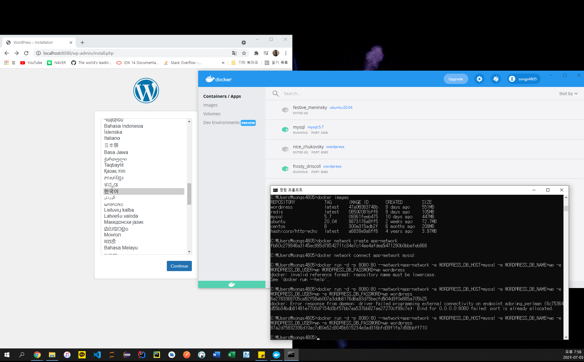

# Docker 명령어
## exec
> exec 명령어는 run 명령어와 달리 실행중인 도커 컨테이너에 접속할 때 사용하며 컨테이너 안에 ssh server등을 설치하지 않고 exec 명렁어로 접속한다.

👀 도커는 다양한 데이터베이스를 손쉽게 생성/삭제할 수 있기 때문에 개발시 많이 사용된다.

## ps
> 실행중인 컨테이너 목록을 확인하는 명령어.  
> 중지된 컨테이너도 확인하려면 -a 옵션을 붙인다.
```bash 
> docker ps
```

## stop
> 실행중인 컨테이너를 중지하는 명령어.   
> 실행중인 컨테이너를 하나 또는 여러개(띄어쓰기) 중지 할 수 있음.
```bash
> docker stop [OPTIONS] CONTAINER [CONTAINER...]
```

## rm
> 종료된 컨테이너를 완전히 제거하는 명렁어.
```bash
> docker rm [OPTIONS] CONTAINER [CONTAINER...]
```

## logs
> 컨테이너가 정상적으로 동작하는지 확인하는 방법.
> 기본 옵션, -f, --tail 옵션을 주로 사용함.
```bash
> docker logs [OPTIONS] CONTAINER
```

## images
> 도커가 다운로드한 이미지 목록을 보여주는 명령어.
```bash
> docker images [OPTIONS] [REPOSITORY[:TAG]]
```

## pull
> 이미지를 다운로드하는 명령어.
```bash
> docker pull [OPTIONS] NAME[:TAG|@DIGEST]
```
예시)
```bash
> docker pull ubuntu:18.04
```

## rmi
> 이미지를 삭제하는 방법. 단, 컨테이너가 실행중인 이미지는 삭제되지 않는다.
```bash
> docker rmi [OPTIONS] IMAGE [IMAGE...]
```

## network create, connect 명령어
> create: 도커 컨테이너끼리 이름으로 통신할 수 있는 가상 네트워크를 만든다.  
> connect: 기존에 생성된 컨테이너에 네트워크를 추가한다.
```bash
> docker network create [OPTIONS] NETWORK
> docker network connect [OPTIONS] NETWORK CONTAINER
```
예시)   
app-nectwork라는 이름으로 wordpress와 mysql이 통신할 네트워크를 만들고 mysql 컨테이너에 네트워크를 추가한 뒤 워드프레스를 app-network에 속하게 하고 mysql을 이름으로 접근하는 예시.
> 